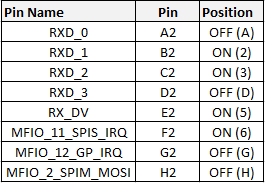
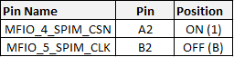
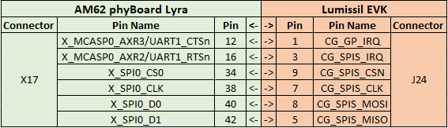

Table of Contents
=================
	1. Introduction
	2. Adding the meta-cg5317 layer to your build
	3. Enabling Overlay

1 - Introduction
==================
This repo holds the software necessary to enable SPI communication between the AM62/AM62A PHYTEC Phyboard-Lyra carrier board and the Lumissil IS32CG5317 EVK.

## Lumissil EVK Hardware Setup and Connections
The Lumissil EVK needs to have the following switch configurations set so that the SPI communication is set to Mode 1 and connected to an external host.

- **Switch SW3** - Set to the OFF position (EXT silkscreen)

- **Switch S10**


- **Switch S11** - 


## Pin Configurtion


There are two items included in this meta-layer.

- **Device Tree Overlay** - contains the device tree changes that we need to MUX our SPI pins on the expansion header, and to enable the driver for the cg5317 device.

- **Lumissil lms-eth2spi SPI Driver** - spi driver that will be built into the BSP

2 - Adding the meta-cg5317 layer to your build
======================================================

Enter the `/sources` directory of your yocto build and clone the meta-layer

```bash
# Clone the meta-layer
git clone https://github.com/phytec-labs/meta-cg5317

# Add the layer to Yocto
bitbake-layers add-layer meta-cg5317
```

You can make sure the build was successful by checking to see if `k3-am62-phyboard-lyra-cg5317.dtbo` is present on the SD cards `/boot ` partition.

3 - Enabling and Testing Overlay
=================================

Stop the boot sequence in u-boot and run the following commands to enable the device tree overlay.

```bash
=> setenv overlays k3-am62-phyboard-lyra-cg5317.dtbo
=> saveenv
```

You can now connect X17 of the AM62 kit to J24 of the Lumissil EVK, and begin the boot sequence.

### **!! Important !!**
1. You must wait and power on the Lumissil EVK after the AM62 has initiated its boot sequence or the AM62 will not boot. This can be achieved by waiting 1-2 seconds to power on the Lumissil EVK after powering on the AM62.
2. The Lumissil PLC device will only initialize successfully after a warm reset of the AM62 development kit.

Once booted, we can test to see if our RED beet is connected by running the following:
``` bash 
dmesg | grep spi
```
A successful connection will look like this:
``` bash
root@phyboard-lyra-am62xx-2:~# dmesg | grep spi
[    1.180349] spi-nor spi0.0: mt35xu512aba (65536 Kbytes)
[    4.544930] lms_eth2spi: loading out-of-tree module taints kernel.
[    4.558884] Initialising lms_eth2spi version 0.0.7
[    4.569010] lms_eth2spi spi3.0: SPI controller min possibled speed  : 1464Hz
[    4.581273] lms_eth2spi spi3.0: SPI controller max possible speed   : 48000000Hz
[    4.588747] lms_eth2spi spi3.0: SPI lms driver configured max speed : 1000000Hz
[    4.596193] lms_eth2spi spi3.0: Translation to 'LSB first' happens in software
[    4.609659] lms_eth2spi spi3.0: Status 0 sanity check passed
[    4.620565] lms_eth2spi spi3.0: Using random MAC address: 00:16:e8:56:a0:13
```